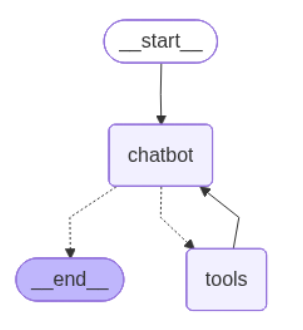

🇬🇧 [English](README.md) | 🇪🇸 Español

# Agentic RAG - Películas y Papers Académicos

Sistema de **RAG agentic** desarrollado como proyecto académico grupal, capaz de responder preguntas sobre un dataset de películas (Letterboxd) y sobre un conjunto de papers académicos, combinando recuperación de información, razonamiento y memoria conversacional.

---

## Descripción general

El agente integra tres capacidades principales:

- **RAG sobre dos fuentes de conocimiento**: un dataset estructurado de películas y seis papers académicos en PDF.
- **Tool-calling con LangGraph**: el LLM decide dinámicamente si debe consultar el dataset de películas, buscar conceptos teóricos en los PDFs, acceder a la memoria reciente, o responder directamente (small talk).
- **Memoria de corto plazo**: las últimas interacciones se guardan en el estado del agente, permitiendo referencias como "eso", "lo anterior" o "qué te dije", para mantener un flujo conversacional coherente.

El diseño busca evitar alucinaciones: el agente nunca genera contenido factual sin evidencia recuperada previamente desde las bases vectoriales.

## Arquitectura

El pipeline se organiza en cuatro capas:

1. **Carga y preprocesamiento de datos** - normalización del dataset de películas (Letterboxd, 28 columnas) y de los 6 papers (carga por página con `PyPDFLoader`, lematización, expansión de abreviaturas, eliminación de stopwords).
2. **Chunking y embeddings** - `RecursiveCharacterTextSplitter` (chunk size 500/overlap 50 para películas, 700/100 para papers) y embeddings con `sentence-transformers/all-MiniLM-L6-v2`, indexados en dos índices independientes de **Pinecone** (`letterboxd` y `rag-pdfs-obligatorio`).
3. **Recuperación semántica mediante tools** - tres herramientas especializadas:
   - `buscar_peliculas`: normaliza la consulta, arma filtros dinámicos por metadata (país, década, género, idioma) y realiza búsqueda híbrida (`top_k=10`).
   - `buscar_papers`: expande terminología técnica (RAG, embeddings, attention, GPT) y busca en el índice de papers (`top_k=3`).
   - `consultar_memoria`: resuelve referencias a interacciones previas usando un array auxiliar de las últimas 5 interacciones.
4. **Razonamiento agentic y generación controlada** - grafo construido con **LangGraph**, con un nodo de decisión (`chatbot_node`) que detecta small talk manualmente y delega el resto de la clasificación de intención al LLM mediante `bind_tools`. El LLM usado es `Qwen/Qwen3-4B-Instruct` vía `HuggingFaceEndpoint` (`temperature=0.3`, `repetition_penalty=1.1`, `max_new_tokens=512`).

## Prompt engineering

Se combinan tres tipos de prompts:

- **Prompt de sistema principal**: define el rol del agente, describe cuándo usar cada tool, prohíbe explícitamente inventar información, y explica cómo resolver referencias contextuales y respuestas breves ("sí", "ok", "dale").
- **Prompt reducido para small talk**: evita activar tool-calling en mensajes triviales.
- **Prompt enriquecido para tool-calling automático**: incluye el historial y las descripciones de las herramientas para que el LLM decida de forma autónoma qué invocar.

Instrucciones clave aplicadas: *"NO inventes información"*, *"Usa EXCLUSIVAMENTE los datos devueltos por la herramienta"*, y una instrucción fija de responder siempre en español (mientras los datos indexados se mantienen en inglés, sin traducir).

## Desafíos y decisiones de diseño

| Desafío | Solución |
|---|---|
| Mezcla de idiomas en las respuestas | Mantener los datos en inglés e instruir al modelo a responder siempre en español, en vez de traducir el dataset |
| Memoria inconsistente en el `AgentState` | Array global auxiliar como respaldo de las últimas interacciones |
| Complejidad de un nodo dedicado a small talk | Detección integrada en `chatbot_node` vía `es_smalltalk()` |
| `top_k=3` insuficiente en búsqueda de películas | Se subió a `top_k=10` para mejorar cobertura sin generar ruido excesivo |
| Memoria resuelta sin tool explícita | Se convirtió en una tool (`consultar_memoria`) para mayor trazabilidad y control |

## Pruebas realizadas

Se evaluó el agente con un conjunto fijo de consultas representativas, usando dos modalidades: ejecución directa (solo respuesta final) y ejecución con stream paso a paso (nodos, tool-calls y resultados intermedios). Casos cubiertos:

1. Small talk (saludo)
2. Ingreso de dato a memoria de corto plazo
3. Recuperación simple sobre el dataset
4. Síntesis de contenido de los papers
5. Búsqueda por atributo/metadata (país)
6. Combinación de RAG + razonamiento + memoria
7. Consulta multi-criterio (país + género)
8. Memoria conversacional inmediata (repetir última respuesta)
9. Cita de fuente (anti-alucinación)
10. Cierre conversacional

El detalle de cada prueba, con los prompts y respuestas obtenidas, está documentado en el notebook y en el informe.

## Interfaz

Se implementó una interfaz de chat con **Gradio** que preserva el `AgentState` entre turnos, permitiendo probar el flujo completo (razonamiento, tool-calling y memoria) de forma interactiva.

## Posibles mejoras futuras

- **Deep agents**: descomponer preguntas complejas en sub-tareas y planificar múltiples consultas a herramientas antes de responder.
- **Re-ranking**: agregar una etapa que reevalúe los documentos recuperados y filtre solo los más relevantes antes de generar la respuesta.
- **Memoria de largo plazo**: persistir preferencias e información del usuario entre sesiones, no solo dentro de una conversación.

## Cómo ejecutar

El notebook fue desarrollado y pensado para correr en **Google Colab** (usa `google.colab.drive` y `userdata` para los secretos).

1. Abrir `Obligatorio_Taller_IA.ipynb` en Google Colab.
2. Configurar los secretos `HF_TOKEN` (Hugging Face) y `PINECONE_API_KEY` (Pinecone) en Colab.
3. Ejecutar las celdas en orden. Si los índices de Pinecone ya fueron creados previamente, se puede omitir la etapa de indexación (ver nota en el propio notebook).
4. La última sección levanta una interfaz de Gradio para chatear con el agente.

## Stack tecnológico

`LangChain` · `LangGraph` · `Pinecone` · `sentence-transformers` · `Hugging Face` (Qwen3-4B-Instruct) · `Gradio` · `spaCy` · `pandas`

## Fuentes de datos

- Dataset de películas: [Letterboxd Movies Dataset (Kaggle)](https://www.kaggle.com/)
- 6 papers académicos provistos por la cátedra